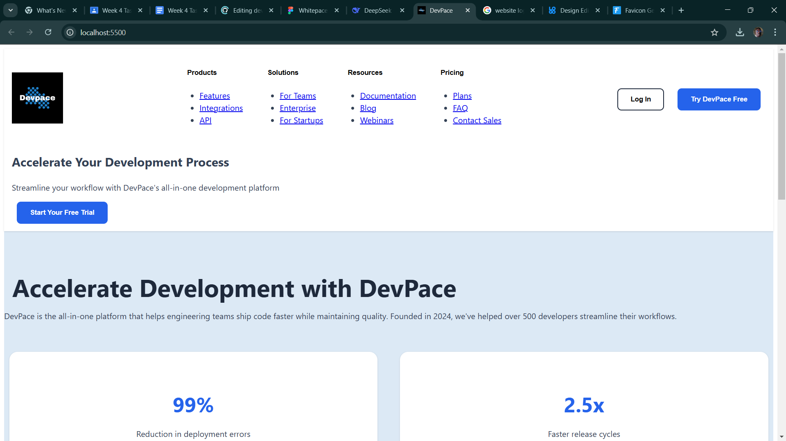
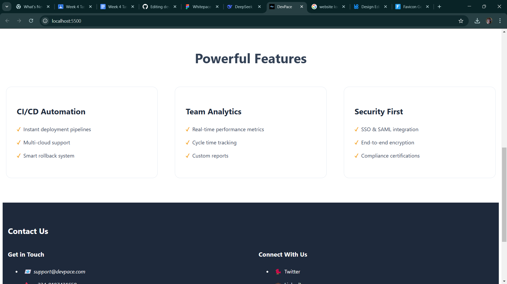

# DevPace Landing Page

A modern, responsive landing page for DevPace—a development platform—built with semantic HTML5 and CSS3. Designed to showcase key product features, testimonials, and drive user conversions.




## Features

### Content Sections
- **Header**: Sticky navigation with dropdown menus and auth buttons
- **Hero Section**: Bold value proposition with a primary CTA
- **About Section**: Company overview with key statistics
- **Features**: Product capabilities in a grid layout
- **Testimonials**: Customer quotes in card format
- **CTA Section**: Final conversion prompt
- **Footer**: Contact info and social links

### Technical Implementation
- ✅ Mobile-first responsive design
- ✅ Semantic HTML5 structure
- ✅ CSS Grid/Flexbox layouts
- ✅ Interactive hover states/transitions
- ✅ Accessible markup (ARIA labels, alt text)
- ✅ Modern CSS features (`clamp()`, `min()`)

## Technologies Used
- **HTML5**: Semantic structure
- **CSS3**:  
  - Flexbox/Grid for layouts
  - `clamp()` for fluid typography
  - Media queries for responsiveness
- **Design Principles**: Contrast, hierarchy, alignment

## Installation
1. Clone the repository:
   ```bash
   git clone https://github.com/your-username/devpace-landing-page.git

2. Open in Broswer:
